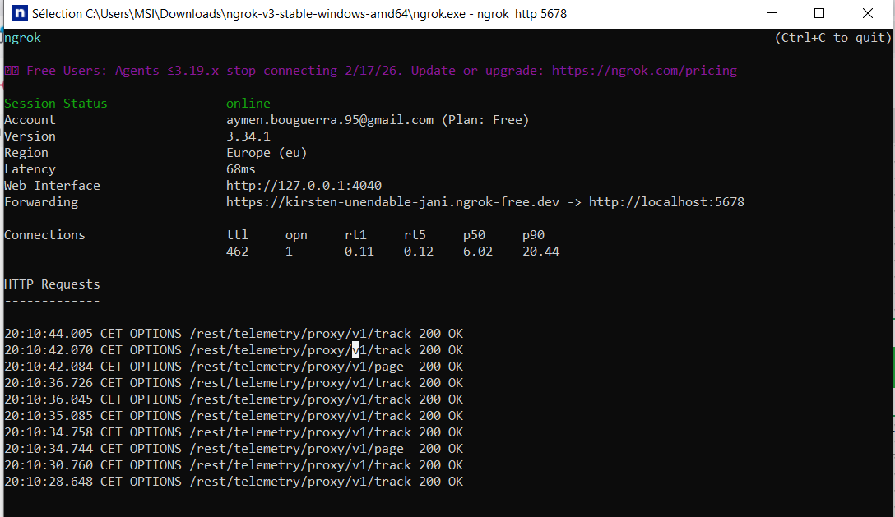

he look just words not images !! 
LinkedIn Automation with n8n, Docker & ngrok
🚀 Automate your LinkedIn posts using n8n workflow, Docker, and ngrok.

Overview
This project demonstrates how to automate LinkedIn posts by integrating n8n with LinkedIn API. Using Docker ensures easy deployment, while ngrok allows secure local tunneling for webhook testing.

Features
Publish posts to LinkedIn automatically.
Schedule updates without manual intervention.
Capture screenshots of workflow execution.
Fully containerized with Docker for portability.
Tech Stack
n8n
Docker
ngrok
LinkedIn API
Getting Started
Prerequisites
Docker installed
ngrok account
LinkedIn developer application
Steps
Clone this repository:
git clone https://github.com/aymenbouguerra95/linkedin-n8n-automation.git
cd linkedin-n8n-automation

